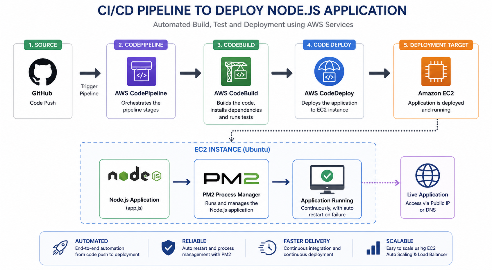
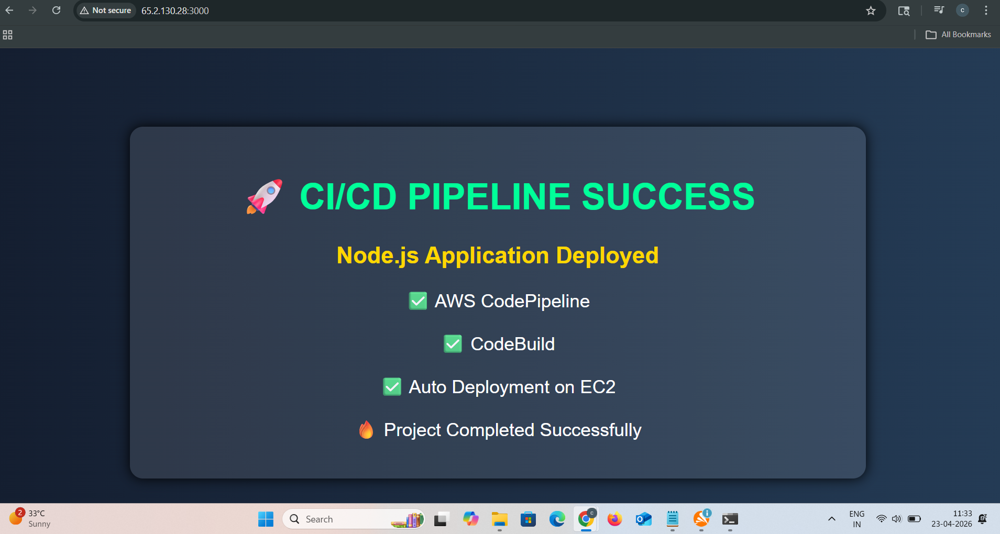
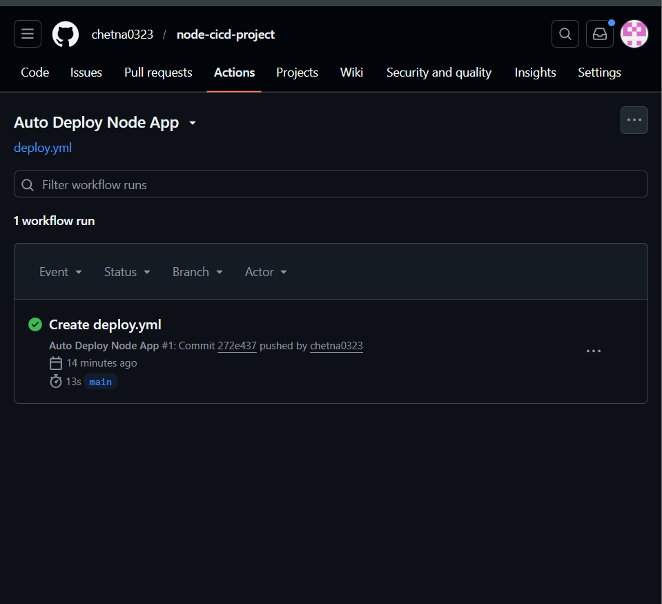
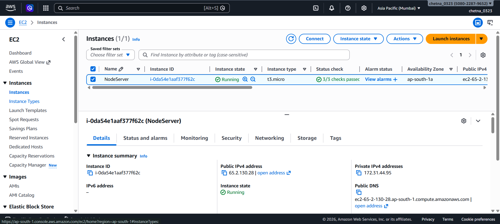
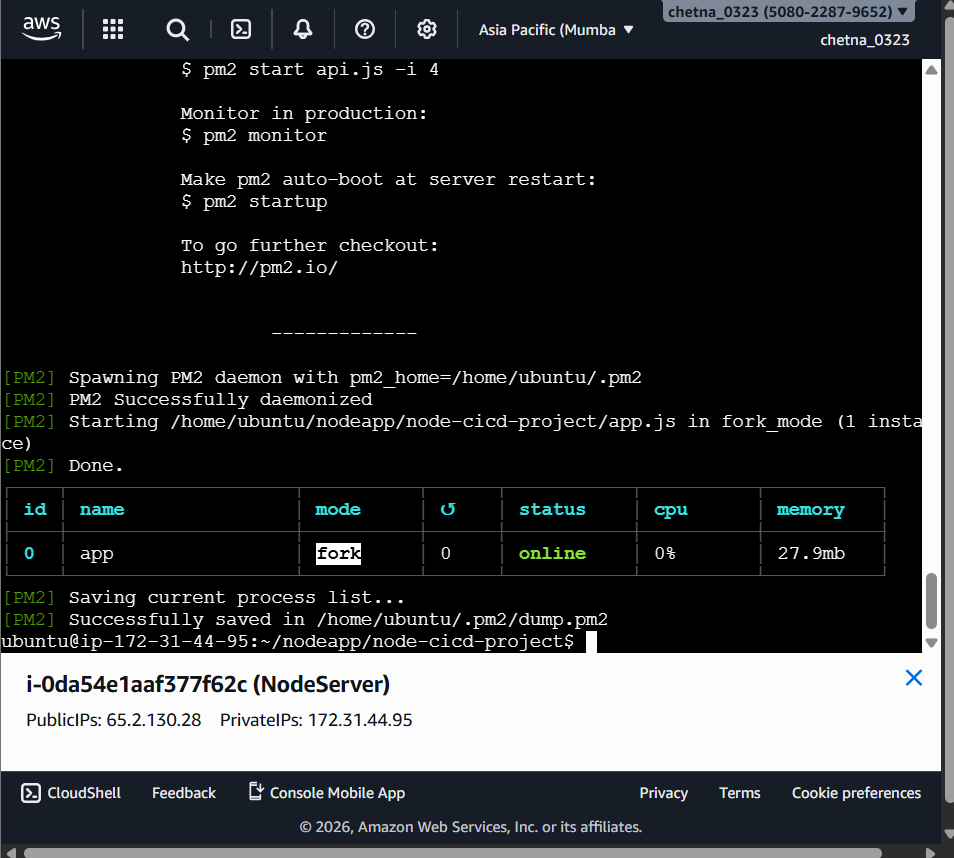
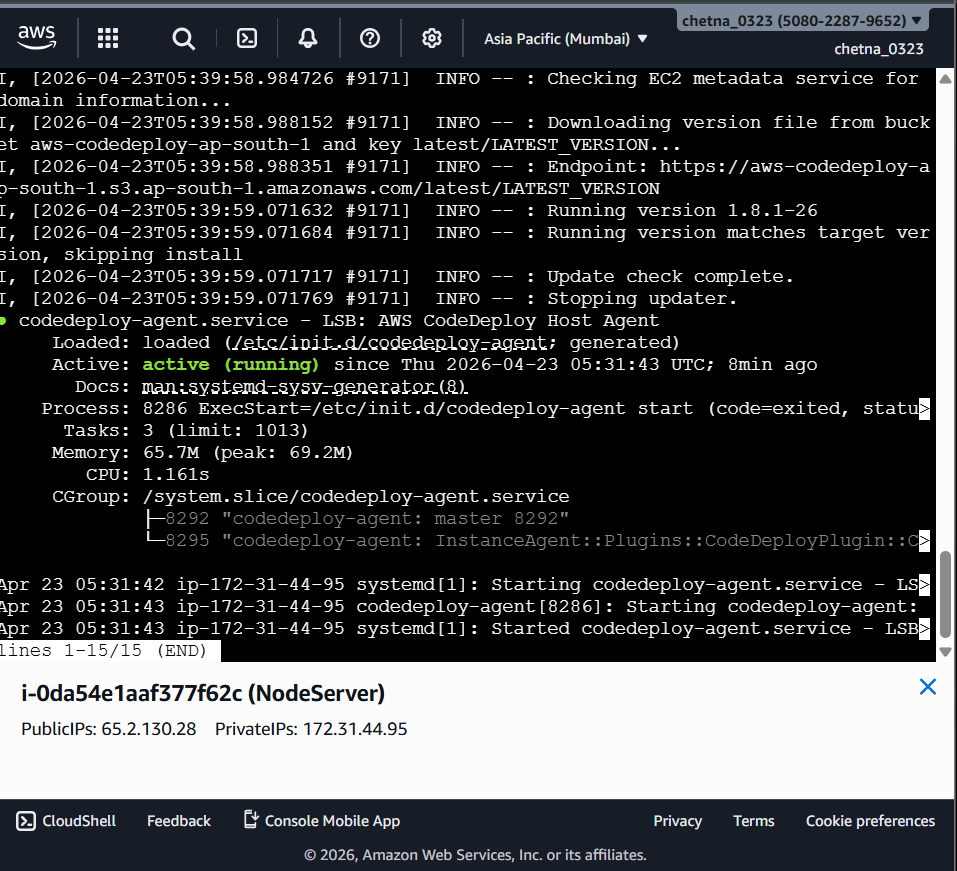

🚀 CI/CD Pipeline to Deploy Node.js Application


---

📌 Project Overview

This project demonstrates a complete **CI/CD pipeline to deploy a Node.js application** using AWS services.
The application is automatically built and deployed to an EC2 instance whenever changes are pushed to the GitHub repository.

---

🎯 Purpose

* Auto deploy app on every code change
* Continuous Integration & Continuous Deployment
* Eliminate manual deployment

---

🧰 Tech Stack

* AWS CodePipeline
* AWS CodeBuild
* Amazon EC2
* GitHub
* Node.js

---

🏗️ Architecture Diagram



This diagram shows the complete CI/CD workflow from GitHub → CodePipeline → CodeBuild → EC2 deployment.

---

🌐 Live Application Output



This shows the successfully deployed Node.js application running on EC2.

---

⚙️ GitHub Actions / Pipeline Trigger



This shows the workflow triggered automatically when code is pushed.

---

☁️ AWS EC2 Instance



The application is deployed and running on an EC2 instance.

---

🔄 Deployment Using PM2



PM2 ensures the Node.js app runs continuously and restarts automatically.

---

🔍 Deployment Logs / CodeDeploy Agent



This shows deployment logs confirming successful execution of the pipeline.

---

📂 Source Code

🔗 https://github.com/chetna0323/CICD-Pipeline-to-Deploy-Node.js-Application

---

🔥 Key Features

* Fully automated CI/CD pipeline
* GitHub integration
* Build with CodeBuild
* Deployment on EC2
* Process management using PM2
* Real-time deployment logs

---

📁 Project Structure

```
CICD-Pipeline-to-Deploy-Node.js-Application/
│── app.js
│── package.json
│── README.md
│── .github/
│   └── workflows/
│       └── deploy.yml
│── screenshots/
│   ├── final-output.png
│   ├── github-actions.png
│   ├── ec2.png
│   ├── pm2.png
│   ├── deployment-logs.png
│   └── architecture.png
```

